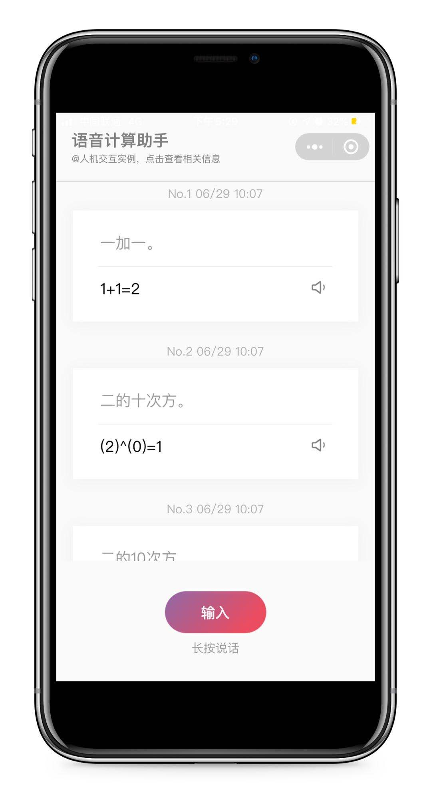
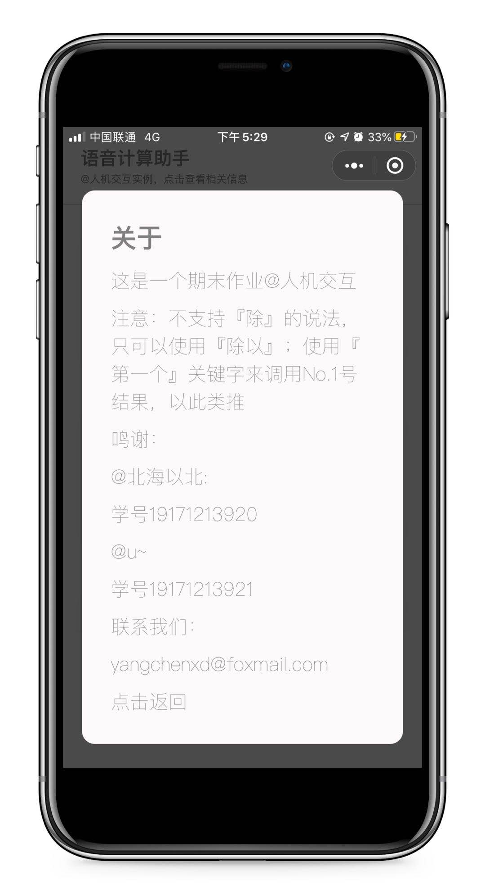

# 语音计算助手

## 预览

## 下载与使用

1. 克隆代码
2. `project.config.json` 中的 `appid` 替换成在公众平台申请的项目 id
3. 在 `公众平台 → 设置 → 第三方服务 → 插件管理` 中 添加微信同声传译插件 (`wx069ba97219f66d99`)
4. 打开微信开发者工具中添加项目

## 微信版本要求

基础库版本 >= `1.9.94`

- 使用插件，需要基础库版本 >= `1.9.6`
- 插件内调用`wx.getRecorderManager`接口，需要基础库版本 >= `1.9.94`
